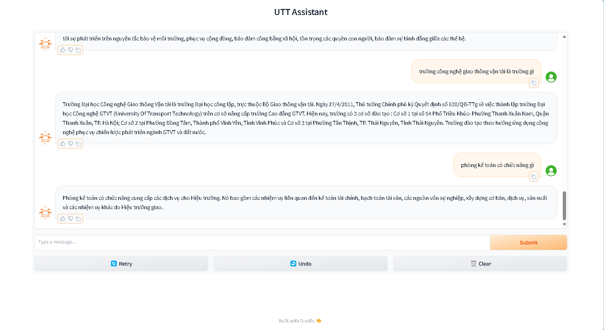

# Building a Retrieval-Augmented Generation System for Automated Information Q&A at the University of Transport Technology
## Overview
This is my university graduation thesis with the topic of building an automatic information question and answer system for the [University of Transport Technology (UTT)](https://utt.edu.vn/). The main technology used is Retrieval Augmented Generation with models such as embedding, ranker, generator that I have improved and refined to suit the data domain of this problem, in addition to combining with other techniques. others to build a system that can operate optimally. The main goal is to build a compact system that can still ensure the task of correctly answering information for the school. For more details, you can read my [report](Report.pdf).

In addition, during the process of writing this graduation thesis, I also built the [RAG_chatbot](https://github.com/Nguyendat-bit/RAG_chatbot) library to support training and inference of Embedding, Ranker, LLM models along with being able to easily deploy and monitor training, easily fine-tune parameters and optimize the model. 

Overview, in terms of architecture, the system will include 3 main modules NLU, QA Core, Database. NLU will decide which domain the input question belongs to (Chitchat or UTT). The smaller QA and Chitchat modules included in QA Core are essentially the same. Chitchat will be much simpler when there is no need to retrieve information, instead using pre-defined chatbot introduction texts combined with input questions to respond to the answer.

 

Regarding the main functions, in addition to the chatbot's ability to answer general self-introduction and greeting questions. The system can answer questions related to training regulations, student affairs, and information search. Searching for information will mainly be general information related to the school and lecturers.

 

### Demo 
Checkout my demo video below  

### Contacts
If you have any questions about this article, please contact me (nduc0231@gmail.com)
